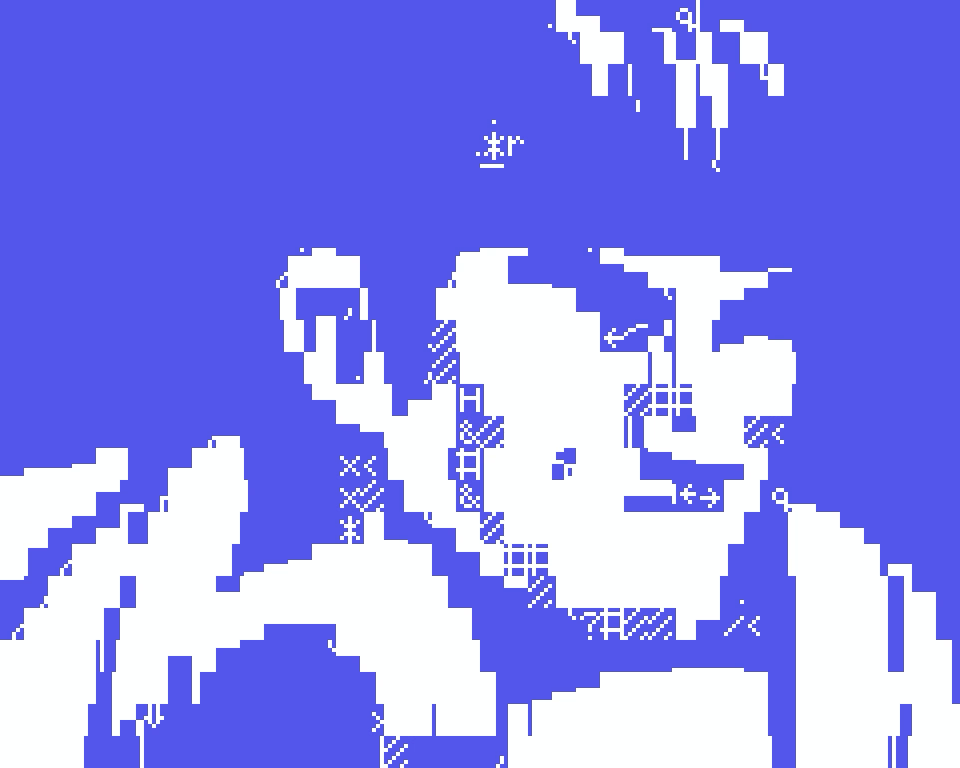
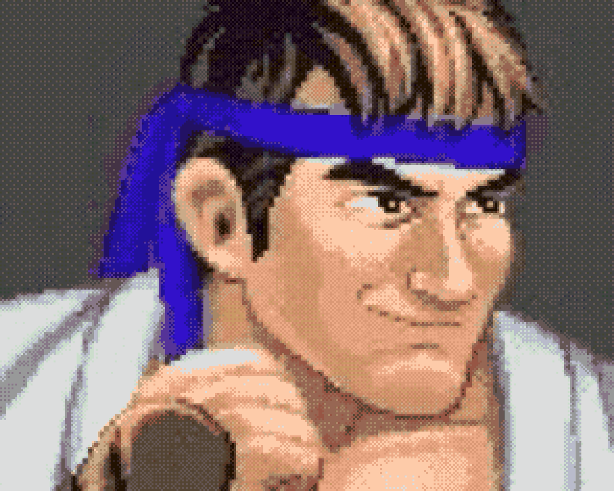
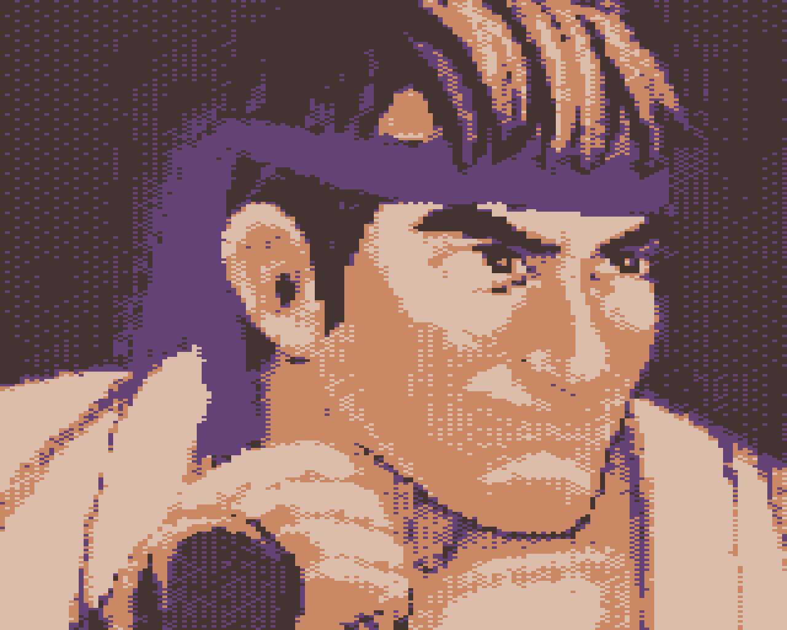

# 😀 Happy Ryu (風林火山)

Ryu, my fave street fighter, just cannot be happy. Never once have I seen him crack a smile. It's okay though, because in this set of pieces we have a very
smile-y Ryu in 43 variations: one per vintage graphics device. Why do all this? Well, I've always been amazed that the game that Ryu is in (Street Fighter II) was ported to so many consoles and computers. Even ones so underpowered to deliver a satifying SF2 experience. But we've never really seen the bust of Ryu on an Atari 2600 so it's super neat to render him in such a way. So there it is, 43 variations of Ryu doing the improbable in graphics that may seem crude to the modern eye but are totally endearing to me.

Let's catalogue all the ways Ryu might be happy (if only for an instant) whilst being rendered on so many different computers and consoles of the past. All editions are MP4 videos with an in/out pixelation flourish. They come in various sizes, upscaled from the display resolutions of the graphics device.

  

### happy-ryu-01

A teletext Ryu

Teletext is something I experienced later in life and I feel I really missed out of something.

`text -> 1248x1104`

HEN LINK: 

### happy-ryu-02

An Apple II Ryu

I could never imagine SFII on an Apple II but at least I now know how Ryu might've looked in one.

`text -> 1280x1152`

HEN LINK: 

### happy-ryu-03

An Atari 2600 Ryu

The Atari 2600 is a special console system.

`160x128 -> 960x768`

HEN LINK: 

### happy-ryu-04

A Commodore PET Ryu

This is Ryu in PETSCII. No, really, it is!

`text -> 1280x800`

HEN LINK: 

### happy-ryu-05

An Intellivision Ryu

The intelligent television and Ryu. Imagine moving him in 16 directions.

`160x96 -> 1280x768`

HEN LINK: 

### happy-ryu-06

An NEC PC-8001 Ryu

`160x100 -> 640x400`

HEN LINK: 

### happy-ryu-07

An Atari 400 Ryu

`80x192 -> 960x768`

HEN LINK: 

### happy-ryu-08

A Sinclair ZX80 Ryu

`text -> 1024x768`

HEN LINK: 

### happy-ryu-09

An IBM DOS Ryu

`text -> 2880x1600`

HEN LINK: 

### happy-ryu-10

An IBM CGA Ryu

`160x200 -> 1280x800`

HEN LINK: 

### happy-ryu-11

An Acorn BBC Ryu

`160x256 -> 1280x1024`

HEN LINK: 

### happy-ryu-12

A ZX Spectrum Ryu

`256x192 -> 1024x768`

HEN LINK: 

### happy-ryu-13

A Commodore 64 Ryu

`160x200 -> 1280x800`

HEN LINK: 

### happy-ryu-14

A Colecovision Ryu

`256x192 -> 1024x768`

HEN LINK: 

### happy-ryu-15

A Dragon 32 Ryu

`256x192 -> 1024x768`

HEN LINK: 

### happy-ryu-16

A Fujitsu FM-7 Ryu

`640x200 -> 2560x1600`

HEN LINK: 

### happy-ryu-17

A Thompson TO7 Ryu

`320x200 -> 1280x800`

HEN LINK: 

### happy-ryu-18

A Camputers Lynx Ryu

`256x248 -> 1024x992`

HEN LINK: 

### happy-ryu-19

A Mattel Aquarius Ryu

`text -> 1280x768`

HEN LINK: 

### happy-ryu-20

An MSX Ryu

`256x192 -> 1024x768`

HEN LINK: 

### happy-ryu-21

A Timex Sinclair 2068 Ryu

`256x192 -> 1024x768`

HEN LINK: 

### happy-ryu-22

A Timex Sinclair Ryu

`256x192 -> 1024x768`

HEN LINK: 

### happy-ryu-23

A Sinclair QL Ryu

`256x256 -> 1024x1024`

HEN LINK: 

### happy-ryu-24

An Apple Macintosh Ryu

`512x342 -> 2048x1368`

HEN LINK: 

### happy-ryu-25

A Thompson MO5 Ryu

`320x200 -> 1280x800`

HEN LINK: 

### happy-ryu-26

An Amstrad CPC Ryu

`160x200 -> 1280x800`

HEN LINK: 

### happy-ryu-27

A Tatung Einstein Ryu

`text -> 960x768`

HEN LINK: 

### happy-ryu-28

A Commodore C16 Ryu

`160x200 -> 1280x800`

HEN LINK: 

### happy-ryu-29

An IBM EGA Ryu

`320x200 -> 1280x800`

HEN LINK: 

### happy-ryu-30

An Atari ST Ryu

`320x200 -> 1280x800`

HEN LINK: 

### happy-ryu-31

A Commodore Amiga Ryu

`320x256 -> 1280x1024`

HEN LINK: 

### happy-ryu-32

A Sega Master System Ryu

`256x192 -> 1024x768`

HEN LINK: 

### happy-ryu-33

An MSX 2 Ryu

`256x192 -> 1024x768`

HEN LINK: 

### happy-ryu-34

An NEC PC-88VA Ryu

`640x200 -> 2560x1600`

HEN LINK: 

### happy-ryu-35

An Acorn Archimedes Ryu

`160x256 -> 1280x1024`

HEN LINK: 

### happy-ryu-36

An IBM VGA Ryu

`320x200 -> 1280x800`

HEN LINK: 

### happy-ryu-37

A Sega Genesis Ryu

`320x224 -> 1280x896`

HEN LINK: 

### happy-ryu-38

A Nintendo Game Boy Ryu

`160x144 -> 640x576`

HEN LINK: 

### happy-ryu-39

An Atari Lynx Ryu

`160x102 -> 640x408`

HEN LINK: 

### happy-ryu-40

A Sega Game Gear Ryu

`160x144 -> 640x576`

HEN LINK: 

### happy-ryu-41

A Super Nintendo Entertainment System Ryu

`256x224 -> 1024x896`

HEN LINK: 

### happy-ryu-42

A Ninendo Virtual Boy Ryu

`384x224 -> 1536x896`

HEN LINK: 

### happy-ryu-43

A Spectrum Next Ryu

`256x192 -> 1024x768`

HEN LINK: 

So many variations on a (happy) Ryu and these vintage graphics can really be adorable, ne?
